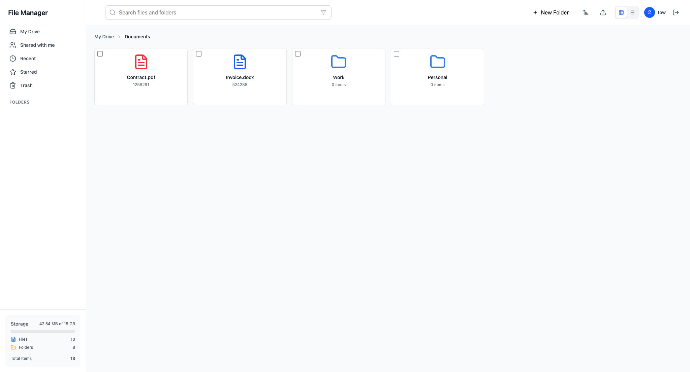

# Drive Manager



A modern, feature-rich file management system built with React, TypeScript, and IndexedDB. Drive Manager provides a Google Drive-like interface for managing files and folders entirely in the browser using client-side storage.

## 🚀 Features

- **File & Folder Management**: Create, rename, delete, move, and organize files and folders
- **Drag & Drop**: Intuitive drag-and-drop interface for moving files and folders
- **File Upload**: Upload multiple files with progress tracking
- **Search & Filter**: Search files and folders with real-time filtering
- **Multiple Views**: Switch between grid and list view modes
- **Sorting Options**: Sort by name, date modified, size, or type
- **User Authentication**: Secure login and registration system
- **IndexedDB Storage**: Each user gets their own isolated database
- **Breadcrumb Navigation**: Easy navigation through folder hierarchy
- **Bulk Operations**: Select multiple files for batch operations
- **Storage Statistics**: Track storage usage and file counts

## 📋 Prerequisites

Before running this project, make sure you have one of the following package managers installed:

- **Node.js** (v18 or higher)
- **npm** (comes with Node.js) or **yarn**

## 🛠️ Installation & Setup

### Using npm

```bash
# Install dependencies
npm install

# Run development server
npm run dev

# Build for production
npm run build

# Preview production build
npm run preview

# Run ESLint
npm run lint

# Fix ESLint errors
npm run lint:fix

# Format code with Prettier
npm run format
```

### Using yarn

```bash
# Install dependencies
yarn install

# Run development server
yarn dev

# Build for production
yarn build

# Preview production build
yarn preview

# Run ESLint
yarn lint

# Fix ESLint errors
yarn lint:fix

# Format code with Prettier
yarn format
```

The application will be available at `http://localhost:5173` (default Vite port).

## 💾 IndexedDB Database Architecture

Drive Manager uses **IndexedDB** for client-side data persistence, providing each user with their own isolated database.

### Database Structure

The application creates a separate IndexedDB database for each user:

- **Database Name**: `user_${userId}_drive` (e.g., `user_123_drive`)
- **Stores**:
  - `files`: Stores file metadata and content
  - `folders`: Stores folder structure and hierarchy

### User-Specific Databases

Each user gets their own database instance:

```typescript
// Database is created per user
const db = new Dexie(`user_${userId}_drive`);

db.version(1).stores({
  files: '++id, name, path, type, size, modified, starred, userId',
  folders: '++id, name, path, items, modified, userId',
});
```

**Benefits:**

- Complete data isolation between users
- No server-side storage required
- Fast, offline-first experience
- Privacy-focused (data stays in browser)

### Data Persistence

All file and folder operations are persisted to IndexedDB:

- Creating/deleting files and folders
- Moving items between folders
- Renaming items
- Starring/favoriting items
- File uploads and downloads

## 🌱 Seed Data

The application includes a seed data system to populate the database with sample files and folders for testing and demonstration purposes.

### Seed Data Location

Seed data is managed in `src/pages/HomePage.tsx`:

```typescript
useEffect(() => {
  const initData = async () => {
    if (hasSeeded.current) {
      return;
    }
    hasSeeded.current = true;

    await seedDatabase();
  };
  void initData();
}, []);
```

### Disabling Seed Data

To disable automatic seed data population, you can:

**Option 1: Comment out the seed call in HomePage.tsx**

```typescript
// await seedDatabase(); // Commented out to disable seeding
```

**Option 2: Remove the useEffect entirely**

```typescript
// Remove or comment out the entire useEffect block
```

### Seed Data Contents

The seed data (`src/db/seedData.ts`) creates:

- Sample folder structure (Documents, Images, Projects)
- Sample files with different types (PDF, images, documents)
- Realistic file metadata (sizes, dates, types)

This helps you test the application without manually creating files and folders.

## 🎯 FileManagerContext - Core State Management

The `FileManagerContext` (`src/context/FileManagerContext.tsx`) is the central hub that manages all file management functionality in the application.

### What It Manages

#### 1. **State Management**

- Current path/location in folder hierarchy
- View mode (grid/list)
- Search query and filters
- Sort preferences
- Selected files
- Loading states
- Storage statistics

#### 2. **File Operations**

```typescript
// Available operations through context
- handleFileUpload(files: File[]): Upload files to current location
- handleFileAction(item, action): Perform actions (rename, delete, download, favorite)
- handleFileDrop(fileId, targetPath): Move files via drag & drop
- handleBulkMove(targetPath): Move multiple selected files
```

#### 3. **Dialog Management**

The context manages three types of dialogs:

- **Confirm Dialog**: For delete confirmations
- **Rename Dialog**: For renaming files/folders
- **New Folder Dialog**: For creating new folders

#### 4. **Data Loading**

```typescript
const loadItems = useCallback(async () => {
  // Fetches items from IndexedDB based on:
  // - Current path
  // - Search query
  // - Sort preferences
  const pathItems = await driveManager.getItemsByPath(currentPath);
  // Updates storage statistics
  const storageStats = await driveManager.getStorageStats();
}, [currentPath, searchQuery, sortBy]);
```

### How Components Use It

```typescript
// In any component
import { useFileManager } from '@/context/FileManagerContext';

function MyComponent() {
  const {
    items, // Current files/folders
    currentPath, // Current location
    loading, // Loading state
    handleFileAction, // Perform file operations
    openNewFolderDialog, // Open dialogs
  } = useFileManager();

  // Use the context values and methods
}
```

### Key Features

1. **Centralized Logic**: All file management logic in one place
2. **Performance Optimized**: Uses `useCallback` and `useMemo` for optimization
3. **Type-Safe**: Full TypeScript support with proper interfaces
4. **Reactive**: Automatically updates UI when data changes
5. **Modular**: Easy to extend with new features

## 🏗️ Tech Stack

- **React 19** - UI framework
- **TypeScript** - Type safety
- **Vite** - Build tool and dev server
- **TailwindCSS** - Styling
- **IndexedDB (Dexie.js)** - Client-side database
- **React Router** - Navigation
- **Lucide React** - Icons
- **ESLint & Prettier** - Code quality
- **Husky & lint-staged** - Git hooks for code quality

## 📁 Project Structure

```
src/
├── components/        # Reusable UI components
├── context/          # React Context providers
│   └── FileManagerContext.tsx  # Main state management
├── db/               # Database layer
│   ├── indexedDb.ts  # Dexie configuration
│   ├── driveManager.ts # Drive operations
│   ├── file.ts       # File operations
│   ├── folder.ts     # Folder operations
│   └── seedData.ts   # Sample data
├── pages/            # Page components
│   └── HomePage.tsx  # Main app page (includes seed data)
├── types/            # TypeScript type definitions
└── utils/            # Utility functions
```

## 🔒 Authentication

The application includes a simple authentication system:

- User registration with email and password
- Login/logout functionality
- User-specific databases (each user gets isolated storage)
- Protected routes

## 🎨 UI/UX Features

- Modern, clean interface inspired by Google Drive
- Responsive design (works on desktop and mobile)
- Smooth animations and transitions
- Keyboard shortcuts support
- Accessibility features

## 📝 Development

### Code Quality

The project uses strict ESLint and Prettier configurations:

```bash
# Check for linting issues
npm run lint

# Auto-fix linting issues
npm run lint:fix

# Format code
npm run format
```

### Git Hooks

Husky is configured to run lint-staged on pre-commit:

- Automatically formats staged files
- Runs ESLint fixes
- Ensures code quality before commits

## 🤝 Contributing

See [CONTRIBUTING.md](./CONTRIBUTING.md) for contribution guidelines.

## 📄 License

This project is open source and available under the MIT License.
